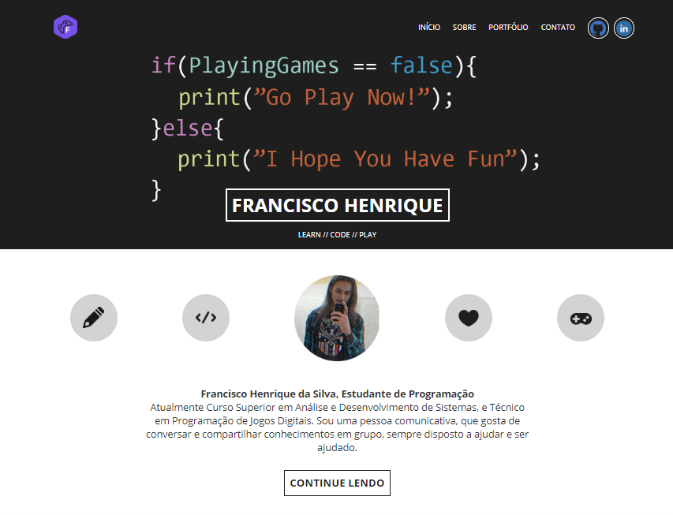

# Site-Potifolio-Responsivo
Por: [***Francisco Henrique***](https://www.linkedin.com/in/francisco-henrique-010912189)

### -Projeto desenvolvido utilizando HTML, CSS, JavaScript, Gulp, Sass.

### Descrição

- Com meus estudos mais recentes para desenvolver sites para WEB, criei este site com intuito de exibir meus projetos
e meus trabalhos.

### [***Acesse o Site***](https://fh-portfolio.000webhostapp.com)

### Projetos

#### - PHP
- Projeto estruturado todo em PHP.

### Dependências

- **package.json**
~~~
"devDependencies": {
    "gulp": "^4.0.2",
    "gulp-sass": "^4.0.2",
    "gulp-watch": "^5.0.1"
  }
~~~  
  
- **bower.json**
~~~
"dependencies": {
    "bootstrap": "^4.3.1",
    "font-awesome": "^5.9.0",
    "bootstrap-sass": "^3.4.1",
    "breakpoint-sass": "^2.7.1",
    "sass-flex-mixin": "^1.0.3"
  },
  "devDependencies": {
    "imagehover.css": "^2.0.0",
    "wow": "wowjs#^1.1.2",
    "jquery": "^3.4.1"
  }
  ~~~
